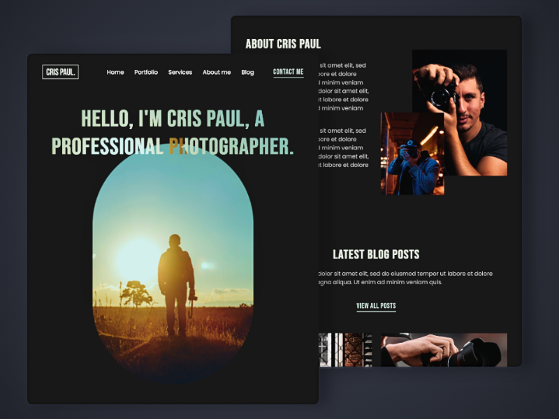

# Portfolio of Professional Photographer : **Cris Paul**
* *This is an eye-catching totally responsive portfolio website with animations for a professional photographer, Cris Paul.*
## Webste Link 
* [CrisPaul Portfolio](https://karanup.github.io/Photographer-Portfolio/)

## A responsive personal portfolio website using HTML, CSS & JavaScript
- Mobile first responsive design
- Utilize grid to create fluid layouts
- Utilize flexbox to align elements
- Animate elements using JavaScript libraries
- Learn about **Scroll Reveal** and **Swiper** libraries for creating the beautiful animations

## Screenshot

## Developer
* **Karan Pandey** : [KaranUp](https://github.com/KaranUp)
